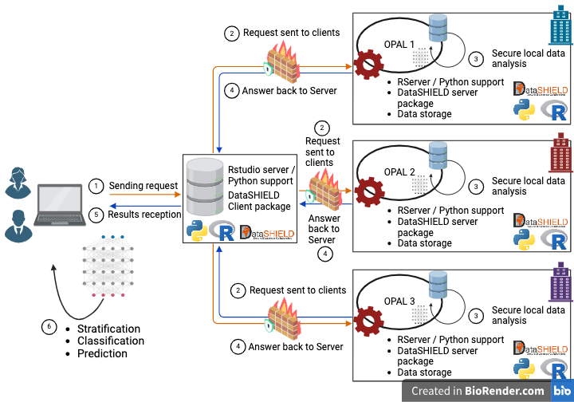
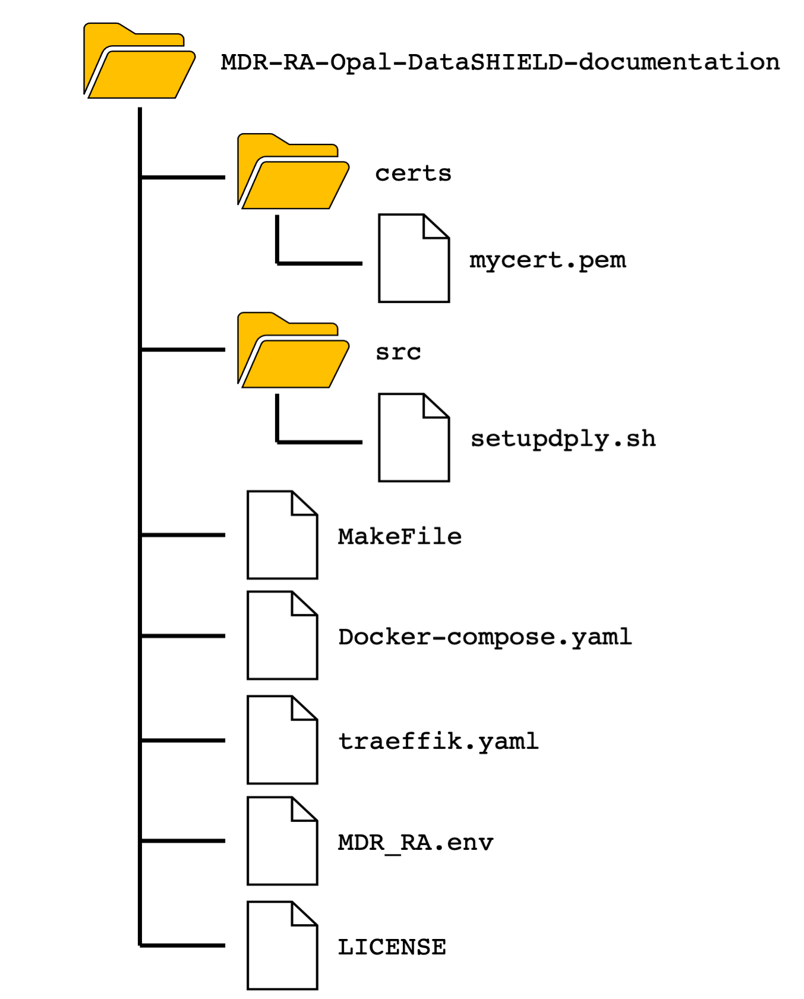

<!--- README file for deployment of Opal-DataSHIELD ecosystem --->

<!--- Add MDR-RA consortium image --->
<p align="center">
    
</p>

# Opal-DataSHIELD ecosystem deployment and usage for the MDR-RA project - External Partners Server Setup

## Synopsis

This document outlines the deployment process, configuration, initialization, and 
usage of the OBiBa Opal-DataSHIELD ecosystem for external partners, as required 
by the MDR-RA project. To ensure portability and reproducibility, the deployment 
leverages [Docker](https://www.docker.com/), a containerization platform that 
enhances the ecosystem's portability and ease of setup across various environments.

**Overview of the Opal-DataSHIELD Architecture**

The Opal-DataSHIELD ecosystem is designed as a federated system, where a client 
communicates with multiple Opal servers to enable secure and privacy-preserving 
analysis of sensitive or distributed data. This architecture ensures that 
individual-level data remains at its source, mitigating privacy risks. Instead 
of sharing raw data, only aggregate or non-disclosive information is exchanged 
between the servers and the client, as illustrated in the figure below.

For detailed documentation, refer to the appropriate sections of this 
[Document](docs/AdvancedTopics.md).

<p align="center">
    
</p>

## Table of contents 

0 - [Quick Deployment](#0-quick-deployment)
<br>1 - [System deployment](#system-deployment)
<br>&nbsp;&nbsp; 1.1 - [Minimum Hardware Specifications](#11-minimum-hardware-specifications)
<br>&nbsp;&nbsp; 1.2 - [Prerequisites](#12-prerequisites)
<br>&nbsp;&nbsp;&nbsp;&nbsp; 1.2.1 - [Operating System Requirements](#121-operating-system-requirements)
<br>&nbsp;&nbsp;&nbsp;&nbsp; 1.2.2 - [Docker engine deployment](#122-docker-engine-deployment)
<br>&nbsp;&nbsp;&nbsp;&nbsp; 1.2.3 - [Make installation](#123-make-installation)
<br>&nbsp;&nbsp; 1.3 - [Deploying Opal-DataSHIELD ecosystem](#13-deploying-opal-datashield-ecosystem)
<br>&nbsp;&nbsp;&nbsp;&nbsp; 1.3.1 - [Downloading and cloning the repository](#131-downloading-and-cloning-the-repository)
<br>&nbsp;&nbsp;&nbsp;&nbsp; 1.3.2 - [Prerequisites for ecosystem deployment](#132-prerequisites-for-ecosystem-deployment)
<br>&nbsp;&nbsp;&nbsp;&nbsp; 1.3.3 [Ecosystem deployment](#133-ecosystem-deployment)
<br>2 - [Quick Opal-DataSHIELD ecosystem test](#2-quick-opal-datashield-ecosystem-test)
<br>3 - [Working with Opal-DataSHIELD ecosystem](#3-working-with-opal-datashield-ecosystem)
<br>&nbsp;&nbsp;3.1 [Log In and Test the Opal-DataSHIELD Web Interface](#31-log-in-and-test-the-opal-datashield-web-interface)
<br>&nbsp;&nbsp;3.2 [Create a New User Profile (Administrator-Only Task)](#32-create-a-new-user-profile-administrator-only-task)
<br>&nbsp;&nbsp;3.3 [Enable Two-Factor Authentication (2FA)](#33-enable-two-factor-authentication-2fa)
<br>&nbsp;&nbsp;3.4 [Change User Permissions](#34-change-user-permissions)
<br>&nbsp;&nbsp;&nbsp;&nbsp;3.4.1 [Change System Permissions (Administrator Only)](#341-change-system-permissions-administrator-only)
<br>&nbsp;&nbsp;&nbsp;&nbsp;3.4.2 [Change Project Permissions](#342-change-project-permissions)
<br>&nbsp;&nbsp;&nbsp;&nbsp;3.4.3 [Change Table Permissions](#343-change-table-permissions)
<br>&nbsp;&nbsp;&nbsp;&nbsp;3.4.4 [Change DataSHIELD Permissions (Administrator Only)](#344-change-datashield-permissions-administrator-only)
<br>&nbsp;&nbsp;3.5 [Manage Folders and Files](#35-manage-folders-and-files)
<br>&nbsp;&nbsp;3.6 [Create and Manage Projects](#36-create-and-manage-projects)
<br>&nbsp;&nbsp;3.7 [Basic DataSHIELD Client Authentication and Data Access](#37-basic-datashield-client-authentication-and-data-access)
<br>4 - [System Security Management](#4-system-security-management)
<br>5 - [System Software Release Tracking and Update Management](#5-system-software-release-tracking-and-update-management)
<br>6 - [Support](#6-support)
<br>7 - [Credits](#7-credits)

## 0 Quick Deployment

Before proceeding with the ecosystem deployment, ensure that you meet all the 
[hardware requirements](#11-minimum-hardware-specifications) and 
[prerequistes](#12-prerequisites) are met before starting the ecosystem
deployment. If you're uncertain whether your setup complies with these recommendations, 
review the respective sections to verify and make any necessary adjustments before 
continuing.

**Step 1: Clone the repository**

Begin by downloading the repository to access the necessary deployment scripts and 
resources. Use the following command to clone the repository:
```bash
git clone https://github.com/InfOmics/MDR-RA-Opal-DataSHIELD-documentation.git
```

**Step 2: Navigate to the Repository Directory**

Once cloned, navigate to the directory containing the repository files:
```bash
cd MDR-RA-Opal-DataSHIELD-documentation
```

**Step 3: Obtain SSL certficates**

Move or copy the obtained SSL certificates to the certs directory within your 
project folder:
```bash
cp mycert.pem certs/  # or mv mycert.pem certs/
```

**Step 4: Configure Deployment Environment Variables**

Navigate to the project folder and set up the environment variables required for 
deployment. Open `MDR_RA.env` and modify the following line, replacing 
`example.domain.com` with your actual domain name (e.g.`my.domain.com`):
```yaml
IP_DOMAIN=my.domain.com  # replaces IP_DOMAIN=myDomainAddress
```

Save and close the file.

**Step 5: Deploy the ecosystem**

With the SSL certificates in place and environment variables configured, you're 
ready to deploy. Use the provided `make` command:
```bash
make deploy
```

This command will:

- Validate the environment setup.
- Configure the services to use the SSL certificates.
- Start the deployment process.

For a quick post-deployment verification, see [section 2](#2-quick-opal-datashield-ecosystem-test).

## 1 System Deployment

This section provides a comprehensive guide for deploying the OBiBa Opal-DataSHIELD 
ecosystem on a **Linux** environment. The deployment process will be discussed in 
detail, including prerequisites such as the required operating system (OS) and recommended 
version, as well as the installation of necessary external dependencies. For a smooth setup, 
[Docker](https://www.docker.com/) and [Docker Compose](https://docs.docker.com/compose/) 
are essential components, enabling efficient container management and orchestration for 
DataSHIELD services. In the sections below, we will cover each prerequisite and guide you 
through the installation and configuration steps needed to prepare your environment for 
deploying the Opal-DataSHIELD ecosystem.<br>
An alternative to using Docker containers for DataSHIELD installation is provided in the [System Security Management](#4-system-security-management) section, 
which describes the use of rootless Podman containers. 

### 1.1 Minimum Hardware Specifications

To ensure optimal performance and stability, the following minimum hardware specifications are recommended:

* **Memory (RAM):** 32 GB or higher
* **Storage:** 500 GB HDD or SSD (SSD preferred for faster read/write operations)
* **CPU:** 16 cores or more
* **GPU (Optional):** While not required, the system may benefit from a compatible GPU for accelerated processing, especially for model training and other compute-intensive tasks.

**NOTE-1:** These specifications are intended to handle large datasets and intensive computational processes. Lower configurations may experience reduced performance or stability issues.

**NOTE-2:** These specifications apply to both host and tenant machines, though each has specific needs:

* **Host Machine:** As the main data storage location, the host should prioritize having ample storage resources to manage extensive datasets effectively.

* **Tenant Machine:** Primarily responsible for sending instructions and processing tasks, the tenant should focus on higher computational resources to manage potentially high volumes of concurrent requests to the host.

### 1.2 Prerequisites

Before proceeding with the deployment of the OBiBa Opal-DataSHIELD ecosystem, ensure 
that your system meets the following prerequisites. Below, we describe each prerequisite 
and provide guidance on how to install them or troubleshoot any missing components:

- Ubuntu >= 22.04.3 LTS (Jammy Jellyfish)
- Ubuntu Terminal
- Docker >= 27.1.1
- Docker-compose
- make

#### 1.2.1 Operating System Requirements

To ensure optimal performance and compatibility, the OBiBa Opal-DataSHIELD ecosystem 
requires **Ubuntu 22.04.3 LTS (Jammy Jellyfish)** or a later version to operate correctly. 
This specific version of Ubuntu is recommended due to its long-term support and stability 
(LTS), providing a robust foundation for deploying the necessary services. Additionally, 
it is crucial to have access to an Ubuntu terminal, as this will be the primary interface 
for executing commands throughout the deployment process.

For users who need to obtain Ubuntu 22.04.3 LTS, the operating system can be downloaded 
from the official [Ubuntu website](https://ubuntu.com/download). Follow the instructions 
to create a bootable USB drive or DVD, or consider installing it in a virtual machine if 
you prefer to run it alongside your existing operating system.

Once Ubuntu is installed, you can access the terminal by searching for "Terminal" 
in the applications menu or by using the keyboard shortcut **Ctrl + Alt + T**. The terminal
will be the primary tool for executing the commands required for the deployment of the OBiBa 
Opal-DataSHIELD ecosystem.

#### 1.2.2 Docker engine deployment

[Docker](https://www.docker.com/) is an open-source platform that enables developers 
to automate the deployment, scaling, and management of applications within lightweight, 
portable containers. Containers package an application and its dependencies, ensuring 
consistent performance across various environments, whether on local machines, virtual 
machines, or cloud infrastructure. By leveraging Docker, users can streamline development 
workflows, enhance collaboration, and maintain system integrity while deploying complex 
applications like the OBiBa Opal-DataSHIELD ecosystem. Its robust ecosystem also includes 
tools like [Docker Compose](https://docs.docker.com/compose/), which simplifies the 
management of multi-container applications through a user-friendly configuration format.

Docker Compose is a powerful tool designed to simplify the management of multi-container 
Docker applications. It allows users to define and run multiple containers as a single 
application using a simple [YAML](https://yaml.org/) configuration file, known as 
`docker-compose.yml`. This file specifies the services, networks, and volumes required 
for the application, along with their respective configurations and dependencies.

With Docker Compose, users can easily start, stop, and manage all containers with 
a single command, streamlining the development and deployment process. It also facilitates 
environment consistency, making it easier to replicate complex setups across different 
stages of development, testing, and production. This makes Docker Compose particularly 
useful for applications that require multiple interconnected services, such as databases, 
web servers, and application servers, enabling a seamless orchestration of the entire 
application stack.

Below is a description of the steps required to install Docker and Docker Compose on 
the machine designated for deploying the OBiBa Opal-DataSHIELD ecosystem. These instructions 
will guide you through the installation process, ensuring that your environment is correctly 
set up for optimal performance and functionality.


##### Installing Docker and Docker Compose

The deployment of the Opal-DataSHIELD ecosystem requires the installation of the Docker 
Engine on the host machine. For detailed instructions on installing the Docker Engine, 
you can refer to the official documentation at [Docker Engine Installation]((https://docs.docker.com/engine/install/)).

**NOTE-1**: The following steps assume that the user has **`sudo`** privileges to execute the 
necessary commands for the installation process.

Before installing Docker, it is essential to remove any conflicting packages that 
might interfere with the installation. To uninstall any potential conflicts, run the 
following command:
```bash
for pkg in docker.io docker-doc docker-compose docker-compose-v2 podman-docker containerd runc; do sudo apt-get remove $pkg; done
```

**NOTE-2**: The `apt-get` command may report that none of these packages are installed.

**NOTE-3**: Older images, containers, volumes, and networks are stored in 
`/var/lib/docker/` and are not automatically removed when uninstalling Docker. To 
start with a clean installation, consider cleaning up existing data by following 
the guidelines provided here.

Before proceeding with the installation of Docker Engine, you must set up the Docker 
repository. This allows you to install and update Docker directly from the repository.

To set up Docker's apt repository, execute the following commands:
```bash
# Add Docker's official GPG key:
sudo apt-get update
sudo apt-get install ca-certificates curl
sudo install -m 0755 -d /etc/apt/keyrings
sudo curl -fsSL https://download.docker.com/linux/ubuntu/gpg -o /etc/apt/keyrings/docker.asc
sudo chmod a+r /etc/apt/keyrings/docker.asc

# Add the repository to Apt sources:
echo \
  "deb [arch=$(dpkg --print-architecture) signed-by=/etc/apt/keyrings/docker.asc] https://download.docker.com/linux/ubuntu \
  $(. /etc/os-release && echo "$VERSION_CODENAME") stable" | \
  sudo tee /etc/apt/sources.list.d/docker.list > /dev/null
sudo apt-get update
```

Once the repository is set up, you can install the Docker packages using the following command:
sudo apt-get install docker-ce docker-ce-cli containerd.io docker-buildx-plugin docker-compose-plugin
```bash
sudo apt-get install docker-ce docker-ce-cli containerd.io docker-buildx-plugin docker-compose-plugin
```

To verify that Docker has been installed successfully, you can run the hello-world image 
with the following command:
```bash
sudo docker run hello-world
```

This command downloads a test image and executes it in a container. Upon running, 
the container will print a confirmation message indicating that the installation was 
successful, and then it will exit.

After successfully installing Docker, it is important to add your user to the Docker 
group. This allows the user to run Docker commands without needing to prefix them with 
`sudo`, enhancing convenience and streamlining workflow.

Use the following command to add your user to the Docker group, replacing `<username>` 
with your actual username:
```bash
sudo usermod -aG docker <username>
```

After executing the command, you need to log out and log back in for the changes to take 
effect. Alternatively, you can also restart your terminal session.

To verify that the user has been added to the Docker group, you can run:
```bash
groups <username>
```

This command will list the groups associated with your user account, and you should 
see "docker" included in the output.

By adding your user to the Docker group, you can now run Docker commands directly 
without needing elevated privileges, simplifying your interactions with the Docker 
ecosystem.

To verify that Docker Compose is installed and available on your system, run the 
following command:
```bash
docker-compose --version
```

This command will display the installed version of Docker Compose if it is correctly 
installed. Seeing the version number confirms that Docker Compose is available and 
ready for use. If you receive an error or no version information, you may need to check 
your installation steps.

#### 1.2.3 Make installation

The `make` tool, commonly used in automation and build processes, is highly valuable 
for deploying Docker images, especially in systems like OBiBa Opal-DataSHIELD. In this 
setup, `make` simplifies deployment by handling repetitive commands through a concise 
set of instructions within a `Makefile`. 

Using `make` for Docker deployment in Opal-DataSHIELD, three key commands are defined:
- **`make deploy`** – This command streamlines the initial deployment process, executing 
a series of Docker commands to build and run containers as specified in the Docker 
configuration.
- **`make up`** – This command brings the server online, handling container startup 
and initialization processes to ensure that the DataSHIELD server is ready for operations.
- **`make stop`** – This command halts the server, stopping all relevant containers and 
freeing resources.

By organizing these operations within `make`, deployment becomes simpler, faster, and 
more reliable, reducing manual command entry and mitigating risks of human error in 
deployment steps.

Below is a description of the steps required to install `make` on the machine designated 
for deploying the OBiBa Opal-DataSHIELD ecosystem. These instructions will guide you 
through the installation process, ensuring that your environment is correctly set up 
for optimal performance and functionality.

##### Installing Make

The deployment of the Opal-DataSHIELD ecosystem requires the installation of `make` on the 
host machine. 

**NOTE-1**: The following steps assume that the user has **`sudo`** privileges to execute the 
necessary commands for the installation process.

Before installing `make` we need to update our OS by using the following command:
```bash
sudo apt update
```

Before starting installation, we may check whether `make` is already installed or not.
Often `make` package can be included by default in Ubuntu distros, so we need to check 
if it is already installed before proceeding. We can check it by running this command: 
```bash
make -version
```

If an error message is displayed, then the package is not installed on the machine. To 
install `make`, type the following command:
```bash
sudo apt install make
```

To verify the installation, we may perform a double-check. First, we can verify the 
`make` binary location by typing:
```bash
ls /usr/bin/make
```

If no error message is displayed we can proceed with the second check:
```bash
make -version
```

If no error message is displayed, the `make`  has been correctly installed on your 
machine. Otherwise, you may need to check your installation steps.

### 1.3 Deploying Opal-DataSHIELD ecosystem

After successfully installing all the required dependencies for the Opal-DataSHIELD 
ecosystem, you are ready to begin the system deployment process. This section 
provides a comprehensive, step-by-step guide to deploying the ecosystem, ensuring 
a smooth and efficient setup.

Each step is designed to help you configure the necessary components, initialize 
the environment, and verify that the ecosystem is fully operational. By following
these instructions, you will be able to deploy the Opal-DataSHIELD ecosystem 
effectively, enabling secure and privacy-preserving data analysis across distributed 
environments.

#### 1.3.1 Downloading and cloning the repository

The first step in deploying the Opal-DataSHIELD ecosystem is to download and clone 
the repository containing all the necessary files and resources required for the 
setup. This repository includes configuration files, deployment scripts, documentation,
and other essential components that will guide you through the deployment process.

Cloning the repository ensures that you have the latest version of the files, along 
with the proper directory structure, to streamline the setup. It is important to 
ensure that `Git` is installed on your system before proceeding. If `Git` is not 
installed, refer to the official 
[installation guide](https://git-scm.com/book/en/v2/Getting-Started-Installing-Git) 
for the Ubuntu OS.

To download the repository, follow these steps:

1. Open a terminal window.
    - On Ubuntu systems, you can find the terminal by searching for "**Terminal**"
    in the application menu.
    - Alternatively, use the keyboard shortcut `Ctrl + Alt + T` on Ubuntu to open 
    the terminal directly

2. In the terminal, enter the following command to clone the repository:
    ```bash
    git clone https://github.com/InfOmics/MDR-RA-Opal-DataSHIELD-documentation.git
    ```
    This command will download the entire repository to your local machine.

3. Once the cloning process is complete, navigate to the downloaded directory to 
view its contents using the following command:
    ```bash
    cd MDRA-RA-Opal-DataSHIELD-documentation
    ```

The downloaded repository will be organized as follows:
<p align="center">
    
</p>

- `certs/`: Contains the SSL/TLS certificates required to enable HTTPS for secure 
communication between components.

- `src/`: Includes scripts and utilities essential for deploying and managing the 
ecosystem. These scripts automate various setup and maintenance tasks, ensuring 
a streamlined deployment process.

- `MakeFile`: A `Makefile` defines the rules and targets for deploying, configuring, 
and managing the system. Using this file, you can execute deployment steps with 
simple commands, such as `make deploy`, `make up` or `make stop`.

- `docker-compose.yml`: The Docker Compose configuration file specifies the 
services, networks, and volumes required to deploy the Opal-DataSHIELD ecosystem. 
It orchestrates the setup of containers, ensuring they are properly connected and 
configured.

- `traefik.yml`: Configuration file for Traefik, the reverse proxy and load 
balancer used in the system. This file defines routing rules, SSL termination, 
and other settings to manage external access to the deployed services.

- `MDR_RA.env`: A `.env` file containing environment variables needed for deployment. 
These variables define configuration options such as service ports, authentication 
credentials, and paths to resources.

- `LICENSE`: Provides the licensing terms under which the repository can be used, 
modified, and distributed.

#### 1.3.2 Prerequisites for ecosystem deployment 

Before proceeding with the deployment of the Opal-DataSHIELD ecosystem, certain 
configurations must be in place to ensure the system is accessible and secure:

1. **Obtain SSL certificates**

To enable secure access to the ecosystem through the HTTPS protocol, you must 
first obtain valid SSL certificates. These certificates ensure encrypted communication 
between users and the ecosystem, safeguarding sensitive data. Be sure that certificates
match the port and domain name designated for the ecosystem deployment.

- If you do not already have SSL certificates, you can generate them or purchase 
them from a trusted certificate authority (CA).

- Once obtained, place the certificates (files in unencrypted form) in the `certs/` directory of the cloned 
repository.

    - Ensure that the files are named appropriately and match the configuration 
    requirements outlined in [**Section 1.3.1**](#131-downloading-and-cloning-the-repository) 
    of the documentation.

    - Verify that the certificates are accessible and have the necessary file permissions 
    to be used during deployment.

2. **Set Ports and IP address/domain**

The next step is to configure the ports and the IP address or domain name that the 
ecosystem will use to expose its services to the web.

- Open the `MDR_RA.env` file located in the root directory of the repository.

- Locate the section defining the Opal administrator password and replace the placeholder with the desired password. For example:
    ```yaml
    OPAL_ADMINISTRATOR_PASSWORD=administrator  # replace default value 
    ```

- Locate the sections defining the ports and replace the placeholders with the desired port numbers. For example:
    ```yaml
    HTTP_PORT=80       # replace default value 
    HTTPS_PORT=443     # replace default value 
    TRAEFIK_PORT=8080  # replace default value 
    ```

- Locate the section defining the domain name and replace the placeholder with 
the desired domain name. This is crucial for generating URLs and ensuring services 
are reachable. For example:
    ```yaml
    IP_DOMAIN=my.domain.com  # replace default value IP_DOMAIN=myDomainAddress
    ```

- Locate the section defining the file names of certificates and replace the placeholder with the desired file names. For example:
    ```yaml
    CERT_FILE=fullchain.pem  # replace default value 
    KEY_FILE=privkey.pem     # replace default value 
    ```

Refer to [Section 3](docs/AdvancedTopics.md#3-docker-compose) in the 
**Advanced Topics Documentation** for detailed instructions on editing 
`docker-compose.yml`.

3. **Verify configuration**

- Ensure that the selected ports are open and not being used by other applications.

- Verify that the IP address or domain name is correctly configured in your 
DNS settings, if applicable.

With the SSL certificates in place and the network settings configured, you 
are ready to proceed to the deployment phase. Proper setup of these elements 
is essential for ensuring a secure, accessible, and functional ecosystem.

#### 1.3.3 Ecosystem deployment

Once all configurations have been properly set up, including SSL 
certificates, ports, and IP address/domain settings, you can proceed with the 
deployment of the Opal-DataSHIELD ecosystem. The deployment process is 
streamlined using the `Makefile` provided in the repository, which automates 
the required steps.

To start the deployment, open a terminal, navigate to the repository 
directory, and type the following command:
```bash
make deploy
```

The `make deploy` command initiates a sequence of operations that automate the deployment process:

1. Execution of Deployment Script:

    - This script from the `src/` directory is executed to prepare and 
    configure the environment.

    - This script handles tasks such as setting up directories, configuring 
    services, and verifying dependencies.

2. Docker Image Creation:

    - The command builds the Docker images defined in the `docker-compose.
    yaml` file.

    - Settings from the `MDR_RA.env` file are used to configure these images, 
    ensuring the ecosystem is tailored to your specifications.

3. Service Startup:

    - The Opal server is launched, making it accessible to external users 
    through the configured HTTPS protocol.

4. Integration of R Server (ROCK):

    - The ROCK Docker image, which provides an R environment for executing 
    DataSHIELD analysis, is added to the ecosystem.

## 2 Quick Opal-DataSHIELD ecosystem test

After deploying the system, you can verify the following to quickly ensure successful deployment:

- Opal Server Accessibility:
    - Open a web browser and navigate to the configured domain or IP address 
    using HTTPS (e.g., https://your-domain.com).

    - Confirm that the Opal login page is visible and accessible.

- Logs and Errors:

    - Monitor the terminal output for any error messages during deployment.
    - If any issues occur, consult the logs/ directory or the documentation for troubleshooting steps.

With the ecosystem now deployed, you are ready to begin using Opal and 
DataSHIELD for secure and collaborative data analysis. For additional 
information on configuring users, datasets, or DataSHIELD analyses, refer to 
[**Section 3**](#3-working-with-opal-datashield-ecosystem) in the 
documentation.

## 3 Working with Opal-DataSHIELD ecosystem

This section provides an introduction to the essential operations for managing 
the Opal-DataSHIELD ecosystem. It covers fundamental tasks such as logging in, 
creating and managing users, enabling two-factor authentication (2FA) for 
added security, and configuring user permissions.

### 3.1. Log In and Test the Opal-DataSHIELD Web Interface

To access the Opal web interface, open a browser and navigate to:
`https://your-domain.com`

Log in using the appropriate user credentials.

**NOTE-1**: For the initial deployment, log in as the administrator using the 
default username `administrator` and the password set in the `MDR_RA.env`
configuration file during setup.

This step ensures the Opal web interface is functioning correctly and ready for further configuration.

### 3.2 Create a New User Profile (Administrator-Only Task)

To create a new user profile, follow these steps:

1. Access the **Administration** page by clicking on the "**Administration**" 
    tab in the Opal web interface.

2. Navigate to the "**Users and Groups**" section.

3. Click the "**+ ADD**" button to open the user creation form.

4. Enter the required details for the new user, including a username and 
    password.
5. Save the changes to complete the user creation process.

This functionality is restricted to system administrators and ensures secure and controlled access to the Opal-DataSHIELD ecosystem.

### 3.3 Enable Two-Factor Authentication (2FA)

To enhance your account's security by enabling Two-Factor Authentication 
(2FA), follow these steps:

1. Log in to the Opal web interface using your credentials.

2. Click on "**My Profile**" in the top-right menu to access your account 
    settings.

3. Scroll down to the "**Two-Factor Authentication**" section.

4. Click the "**Enable 2FA**" button to start the setup process.

5. Follow the on-screen instructions to complete the configuration, which may 
include scanning a QR code with an authenticator app and verifying the 
generated code.

Once enabled, 2FA adds an extra layer of protection, requiring a one-time code 
in addition to your password for future logins.

### 3.4 Change User Permissions 

Managing user permissions in the Opal-DataSHIELD ecosystem allows 
administrators to control access to system features, projects, tables, and 
DataSHIELD operations. The following sections outline how to modify 
permissions at different levels.

#### 3.4.1 Change System Permissions (Administrator Only)

1. Access the **Administration** page.

2. Navigate to the **General Settings** section.

3. Click on the **Permissions** tab and then the **+ ADD** button to assign 
new permissions.

4. Enter the user's name in the input field.

5. Select the desired permission level from the available options (e.g., read, 
write, admin).

6. Click **Submit** to save changes.
  
#### 3.4.2 Change Project Permissions 

1. Go to the **Projects** page and select the project for which permissions 
need to be modified.

2. Open the **Permissions** tab within the selected project.

3. Click the **+ ADD** button to add a new permission.

4. Enter the user's name and choose the appropriate permission level.

5. Submit the changes to update the permissions.


#### 3.4.3 Change Table Permissions 

1. Navigate to the **Projects** page and select the desired project.

2. Choose the table within the project for which permissions need to be 
modified.

3. Open the **Permissions** tab under the table settings.

4. Click the **+ ADD** button to assign permissions.

Enter the user's name, select the permission type, and submit your changes.
  
#### 3.4.4 Change DataSHIELD Permissions (Administrator Only)

1. Access the **Administration** page and go to the **DataSHIELD** section.

2. Open the **Permissions** tab.

3. Click the **+ ADD** button to assign DataSHIELD-specific permissions.

4. Enter the user's name in the input field.

5. Select the permission level (e.g., allow access to specific DataSHIELD operations).

6. Save the changes by clicking **Submit**.

### 3.5 Manage Folders and Files

Efficiently organize and upload data into the user file system by creating 
folders and uploading files. Follow the steps below:

1. **Create a New Folder**

    - Navigate to the Files page within the Opal interface.

    - Click the **+ ADD** FOLDER button.

    - Enter a name for the folder and confirm to create it.

2. **Upload Files**

    - Open the newly created folder or any existing folder where the file 
        should be uploaded.

    - Click the **UPLOAD** button.

    - Select the file from your local machine and confirm the upload.

**NOTE-2**: Ensure the uploaded file is in a compatible tabular format for 
proper processing. 
  
### 3.6 Create and Manage Projects

Projects in the Opal-DataSHIELD ecosystem serve as containers for data tables 
and related configurations. Follow these steps to create and populate projects:

1. **Create a New Project**

    - Navigate to the **Projects** page by selecting the Projects tab.

    - Click the **+ ADD** button to initiate project creation.

    - Enter the project **Name** (required) in the input field.

    - Optionally, provide a **Title** and **Description** to give context to 
        the project.

    - Confirm to create the project.

2. **Import Data Tables**

    - Open the newly created project by clicking on its name in the Projects 
        list.
    - Expand the **Tables (views)** section by clicking the arrow next to it.

    - Click the **IMPORT** button and choose Import from file.

    - Select the desired **data format** (e.g., CSV) and proceed.

    - Click **Select**, navigate to the file's location in the system, and 
    upload it.

    - Follow the prompts to configure and finalize the import process.

**NOTE-3**: The web interface currently supports input files in `.csv` format 
or `.rds` files formatted as a tibble, with a maximum size of 100 MB 
(for files larger than 100 MB, please refer to this [Section](docs/AdvancedTopics.md)). 
These files are automatically loaded into a table (view). 
The same functionality is available through the script 
`Load_Test_Data/Test-datashield-load-data_as_table.R`. To work with other file formats, 
data must be uploaded as a resource using the script `Load_Test_Data/Test-datashield-load-data_as_resource.R`. 
  
### 3.7 Basic DataSHIELD Client Authentication and Data Access

To verify the functionality of the DataSHIELD client, follow these steps to 
connect to your Opal server and retrieve basic data statistics, open R and run:
```R
# DataSHIELD user

# load libraries
library(DSI)
library(DSOpal)
library(dsBaseClient)

# connection builder
builder <- DSI::newDSLoginBuilder()

builder$append(server = "server1", url = "https://your-domain.com",
               user = "user", password = "password", 
               driver = "OpalDriver",
               options='list(ssl_verifyhost=0, ssl_verifypeer=0)')

logindata <- builder$build()

# log in
connections <- DSI::datashield.login(logins = logindata, assign = TRUE)

# data access
# NOTE: 
# - "TEST" is the project's name
# - "airway" is the table's name
DSI::datashield.assign.table(conns = connections, symbol = "Example", 
                             table = c("TEST.airway"))
# table dimensions
ds.dim(x = 'Example')
# table column names 
ds.colnames(x = 'Example')

# log out
DSI::datashield.logout(connections)
```

## 4 System Security Management
DataSHIELD-Opal meets strong security standards, as validated by security audit.<br>
The security of the Opal-DataSHIELD ecosystem utilized in the MDR-RA project is rigorously tested and maintained by our project partner,
[Pluribus One](https://www.pluribus-one.it/), a provider of advanced cybersecurity 
solutions. Leveraging their expertise, Pluribus One ensures our systems remain robust, resilient, and protected against potential threats. 
To guarantee the integrity of organizational infrastructure, security tests will be conducted on an external third-party server.<br><br>
Detailed instructions for the setup of a secure and hardened DataSHIELD deployment are available at this [link](https://github.com/pluribus-one/mdr-ra), managed by Pluribus One.<br><br>
The security of the Opal-DataSHIELD ecosystem utilized in the MDR-RA project, once installed in accordance with the security guidelines [here](https://github.com/pluribus-one/mdr-ra), developed by Pluribus One, is to be considered secure and validated. Throughout the duration of the project, the system as configured by the guidelines and automations provided by Pluribus One will be rigorously and periodically tested in order to protected it against potential threats.
Any installation that does not comply with the security guidelines provided by Pluribus One will not be considered validated nor secure by Pluribus One.
Pluribus One shall bear no responsibility for the security of any system that has not been installed and maintained in accordance with its official guidelines.


For support or security-related inquiries, please contact the dedicated team:

- Luca Piras
- Valentina Del Rio
- Guido Mureddu

* **Email:** <pluribus-one.mdr-ra@pluribus-one.it>

Pluribus One is committed to maintaining the highest security standards and welcomes your concerns or questions. Please do not hesitate to reach out for assistance.

## 5 System Software Release Tracking and Update Management

To ensure effective tracking of new software releases, we will actively monitor public repositories and provide partners with timely updates. Each new release will undergo validation in a controlled environment to confirm compatibility, stability, and adherence to the required security standards.

A centralized log will document release details, including dates, version numbers, key changes, and certifications for deployment within partners' environments. This log will serve as a reliable reference for tracking approved versions.

Our approach prioritizes security, stability, and efficiency to maintain a seamless update process. Partners will be promptly notified of updates, particularly when a release includes critical security or stability patches or introduces features essential to the project's goals.

## 6 Support

For support, please contact: 

* **Email:** mdrra.univr.team@ateneo.univr.it
<br>For any issues, questions, or further assistance, reach out to our dedicated support team via email

* **Referents:**
  - **Rosalba Giugno:** Principal Investigator
  - **Manuel Tognon:** Post-Doctoral Researcher

## 7 Credits

- **Project Leader**: 
  - Prof. Rosalba Giugno <rosalba.giugno@univr.it>

- **Development Team**:  
  - Simone Avesani, PhD <simone.avesani@univr.it>
  - Gospel Ozioma Nnadi <gospelozioma.nnadi@univr.it>

- **Documentation**:  
  - Manuel Tognon, PhD <manuel.tognon@univr.it>
  - Eva Viesi, PhD <eva.viesi@univr.it>

<br><hr>
[Back to top](#opal-datashield-ecosystem-deployment-and-usage-for-the-mdr-ra-project)
